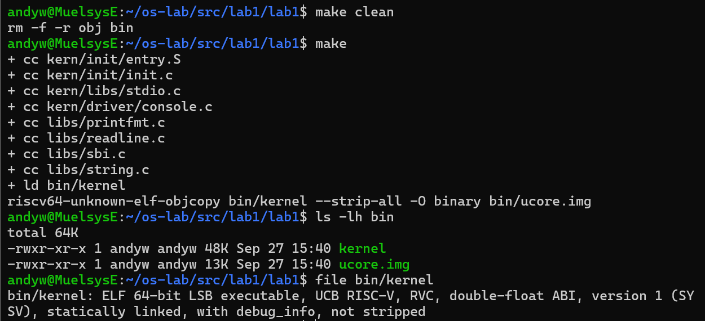
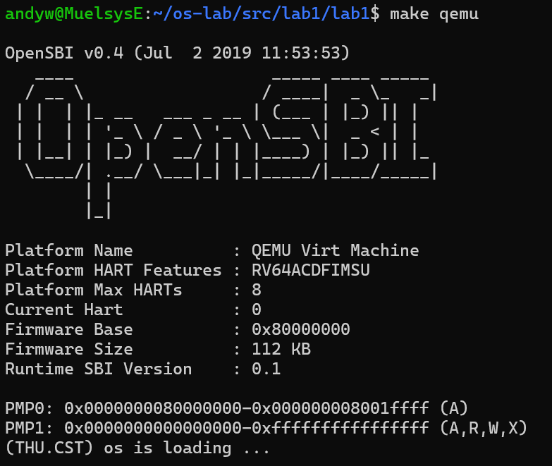
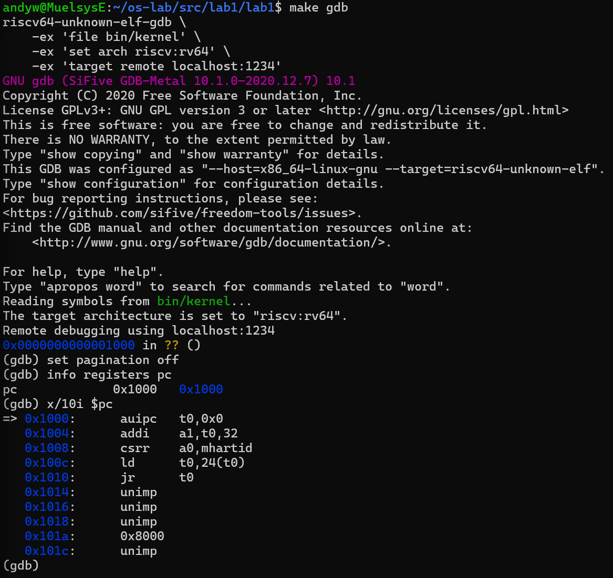
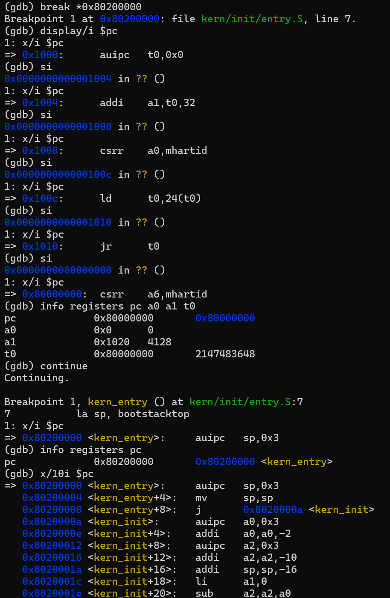
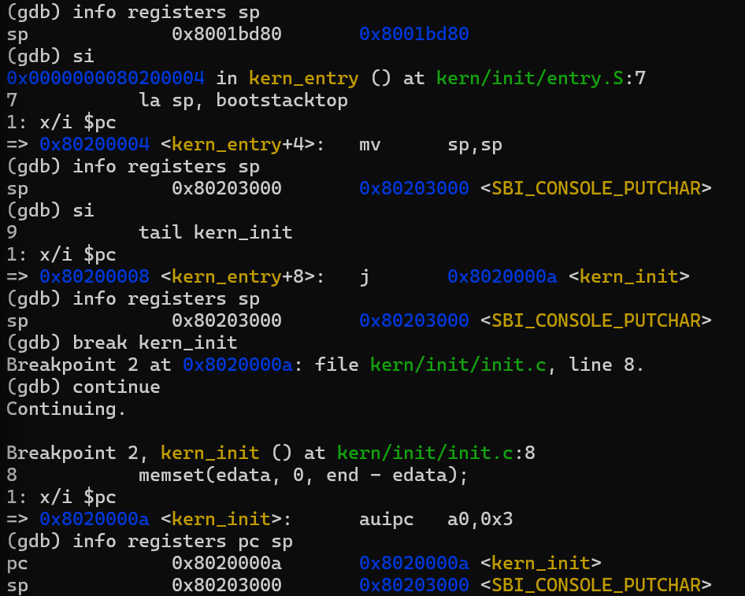

# 实验报告

## 实验基本信息

| 项目 | 内容 |
|---|---|
| **实验名称** | Lab1：比麻雀更小的麻雀——最小可执行内核与启动流程 |
| **成员** | 2511565-闻鹏杰、2511955-洪亮、2511057-祝安毅 |
| **完成日期** | 2026-09-27 |

### 分工说明

| 成员 | 负责的练习/模块 |
|------|----------------|
| 2511565-闻鹏杰 | 实验环境配置、源码阅读、内核编译与运行、QEMU/GDB 调试 |
| 2511955-洪亮 | 内核编译与运行、实验记录与报告整理 |
| 2511057-祝安毅 | 实验环境配置、内核编译与运行、QEMU/GDB 调试 |

---

## 一、实验目的

本实验围绕最小可执行 RISC-V 内核及其启动过程展开，主要目标如下：

1. 理解 RISC-V 虚拟机从复位、执行 OpenSBI 到进入操作系统内核的完整流程。
2. 理解交叉编译、链接脚本、ELF 内核文件和原始内核镜像之间的关系。
3. 阅读 `kern/init/entry.S`，理解建立内核栈以及从汇编入口跳转至 C 语言内核入口的过程。
4. 理解内核如何通过 SBI 服务在 QEMU 串口上格式化输出字符。
5. 掌握使用 QEMU 和 GDB 查看指令、寄存器、内存以及设置断点的基本方法。

---

## 二、实验环境

### 2.1 软件环境

| 项目 | 配置 |
|---|---|
| 操作系统 | Windows 11 |
| Linux 环境 | WSL2 Ubuntu |
| 目标体系结构 | RISC-V 64 位 |
| 交叉编译器 | `riscv64-unknown-elf-gcc` 10.2.0 |
| 模拟器 | QEMU 4.1.1，`qemu-system-riscv64` |
| 固件 | QEMU 默认 OpenSBI v0.4 |
| 编辑器 | Visual Studio Code + WSL 扩展 |
| 调试器 | `riscv64-unknown-elf-gdb` |

### 2.2 AI 工具

| 成员 | AI 编程工具 | 底层模型 | 用途 |
|---|---|---|---|
| 2511565-闻鹏杰 | Codex 桌面版 | GPT-5.6 | 环境配置指导、源码讲解、GDB 调试步骤设计、报告结构整理 |
| 2511955-洪亮 | Claude Code | DeepSeek-V4-Pro | 实验原理讲解、分步操作指导、GDB 追踪方案、提示词与报告整理 |
| 2511057-祝安毅 | Codex 桌面版 | GPT-6 | 实验环境配置指导、GDB 调试指导、实验报告整理 |

AI 主要用于解释代码和实验原理、整理调试步骤及检查报告结构。实验命令、运行结果和截图由本人在本地 WSL/QEMU 环境中执行和取得。

---

## 三、实验整体逻辑分析

### 3.1 本实验的逻辑主线

本实验解决的核心问题是：一个不依赖现成操作系统运行环境的 RISC-V 内核，如何被编译、放入内存、由固件启动，并最终完成控制台输出。

整个流程如下：

```text
C/汇编源代码
    ↓ 交叉编译
RISC-V 目标文件（.o）
    ↓ 按链接脚本链接
ELF 内核 bin/kernel
    ↓ objcopy 转换
原始镜像 bin/ucore.img
    ↓ QEMU loader 放入 0x80200000
QEMU 从复位地址 0x1000 执行
    ↓
OpenSBI 初始化硬件
    ↓ 跳转到 0x80200000
kern_entry 建立栈
    ↓
kern_init 清零 BSS、打印信息并循环
```

### 3.2 功能的逐步实现

1. **首先建立编译环境**：WSL2 提供 Linux 工具链运行环境，RISC-V 交叉编译器生成目标机器指令。
2. **随后编译并链接内核**：Makefile 编译 `.c` 和 `.S` 文件；链接脚本将入口与各段安排到以 `0x80200000` 为起始地址的内存中。
3. **接着启动虚拟硬件和固件**：QEMU 模拟 RISC-V64 `virt` 机器，OpenSBI 完成底层初始化并向内核提供 SBI 服务。
4. **然后进入内核入口**：`kern_entry` 设置栈指针，并通过尾调用将控制权移交给 `kern_init`。
5. **最后完成最小可观察功能**：内核清零 BSS，通过 OpenSBI 在串口打印启动信息，随后进入无限循环保持运行。

必须按照这一顺序进行，因为 C 函数需要先有可用栈；内核必须先被正确链接并加载到预定地址，OpenSBI 才能把控制权交给它；控制台输出也依赖已经运行的 SBI 固件服务。

---

## 四、实验内容与实现

### 4.1 最小内核的编译与启动

**负责人：** 2511565-闻鹏杰、2511955-洪亮、2511057-祝安毅

#### 涉及的主要入口和函数

```c
int kern_init(void) __attribute__((noreturn));
int cprintf(const char *fmt, ...);
void cons_putc(int c);
uint64_t sbi_call(uint64_t sbi_type,
                  uint64_t arg0,
                  uint64_t arg1,
                  uint64_t arg2);
void sbi_console_putchar(unsigned char ch);
```

汇编入口：

```asm
kern_entry:
    la sp, bootstacktop
    tail kern_init
```

#### 模块功能描述

`Makefile` 使用 `riscv64-unknown-elf-gcc` 将源码编译为 RISC-V 目标文件，并按照 `tools/kernel.ld` 生成 `bin/kernel`。随后，`objcopy` 将 ELF 文件转换为 `bin/ucore.img`。执行 `make qemu` 时，Makefile 使用 `-bios default -kernel bin/ucore.img` 启动 QEMU，以观察内核输出；执行 `make debug` 时，则使用 `-bios default -device loader,file=bin/ucore.img,addr=0x80200000 -s -S`，将镜像装入指定地址并暂停 CPU 等待 GDB。两种方式均由 QEMU 装入镜像，OpenSBI 初始化后将控制权交给内核。

内核输出路径为：

```text
cprintf
→ vcprintf / vprintfmt
→ cputch
→ cons_putc
→ sbi_console_putchar
→ sbi_call 中的 ecall
→ OpenSBI
→ QEMU 串口
→ 终端
```

以 `kern_init` 中的 `cprintf("%s\n\n", message)` 为例，格式化后的字符逐个传给 `sbi_console_putchar(ch)`。该函数调用 `sbi_call(SBI_CONSOLE_PUTCHAR, ch, 0, 0)`；本实验的 `SBI_CONSOLE_PUTCHAR` 值为 `1`。`sbi_call` 将服务号放入 `x17`（`a7`）、字符放入 `x10`（`a0`），再执行 `ecall`，由 OpenSBI 提供控制台字符输出服务。这与 QEMU 终端中看到的内核启动信息相对应。

#### 关键文件作用

| 文件 | 作用 |
|---|---|
| `kern/init/entry.S` | 内核汇编入口，建立栈并跳转到 C 入口 |
| `kern/init/init.c` | 清零 BSS、打印启动消息、进入无限循环 |
| `tools/kernel.ld` | 指定入口、加载地址和 `.text/.data/.bss` 的内存布局 |
| `kern/driver/console.c` | 将内核字符输出转换为 SBI 控制台调用 |
| `kern/libs/stdio.c` | 实现内核使用的 `cprintf` 等接口 |
| `libs/sbi.c` | 设置 SBI 调用号和参数，通过 `ecall` 请求固件服务 |
| `libs/printfmt.c` | 实现 `%s`、`%d`、`%x` 等格式化功能 |
| `libs/string.c` | 实现 `memset`、`memcpy`、字符串操作等基础函数 |
| `Makefile` | 组织编译、链接、运行和 GDB 调试流程 |

#### 最终提示词

```markdown
请结合 Lab1 的源码、Makefile 和实验指导，指导我完成最小 RISC-V
内核的编译、QEMU 启动和 GDB 调试。要求逐步解释每条命令的作用，
重点分析 entry.S 中 la sp, bootstacktop 与 tail kern_init 的功能，
并从复位地址 0x1000 跟踪到内核入口 0x80200000。不要替我虚构
运行结果；需要我本地执行或截图的地方应明确标出。
```

#### 实现迭代过程

##### 第一次迭代：建立实验环境

完成 WSL2 Ubuntu、RISC-V 交叉编译器和 QEMU 4.1.1 的安装，并使用 OpenSBI 启动信息验证 QEMU 可以模拟 RISC-V64 `virt` 机器。

##### 第二次迭代：分析源码并完成基础构建

检查压缩包结构，确认真正的工程目录为 `lab1/lab1`。阅读 Makefile、链接脚本、汇编入口、C 入口和 SBI 输出代码，明确 `make` 与 `make qemu` 的执行过程。

##### 第三次迭代：设计启动过程调试方案

根据 Makefile 中的 `-s -S` 参数，采用两个终端分别启动 QEMU 和 GDB；在 `0x1000` 观察复位代码，在 `0x80200000` 设置断点验证内核开始执行，并检查 `sp` 的变化。

当前结果状态：

- [x] 本地重新执行 `make clean && make`，编译成功并保存截图
- [x] 本地执行 `make qemu`，内核成功启动并保存截图
- [x] 本地完成 GDB 调试，保存复位地址、内核入口和栈指针截图

---

### 4.2 练习1：理解内核启动中的程序入口操作

**负责人：** 2511565-闻鹏杰、2511057-祝安毅

#### 4.2.1 `la sp, bootstacktop` 完成了什么操作

`la` 是“加载地址”的伪指令。该指令将符号 `bootstacktop` 对应的地址装入栈指针寄存器 `sp`。

`entry.S` 中预留了内核启动栈：

```asm
.section .data
    .align PGSHIFT
bootstack:
    .space KSTACKSIZE
bootstacktop:
```

其中 `PGSHIFT=12`，一页大小为 4096 字节；`KSTACKPAGE=2`，因此启动栈总大小为 8192 字节。RISC-V 栈通常从高地址向低地址增长，所以应将初始 `sp` 设置为栈顶 `bootstacktop`。

这样做的目的是在进入 C 函数前建立有效的运行栈，使 C 代码可以保存局部变量、返回地址以及需要保护的寄存器。

`la` 是伪指令。本次反汇编显示它被处理为位于 `0x80200000` 的 `auipc sp,0x3` 和位于 `0x80200004` 的 `mv sp,sp`。实测执行前 `sp=0x8001bd80`，执行第一条指令后变为 `0x80203000`，第二条指令执行后保持不变。因此 `0x80203000` 就是本实验的 `bootstacktop`。

#### 4.2.2 `tail kern_init` 完成了什么操作

`tail kern_init` 是尾调用伪指令。它将程序控制权转移到 C 语言函数 `kern_init`，同时不为当前入口保存新的返回地址。

这样做的原因是 `kern_init` 被声明为：

```c
int kern_init(void) __attribute__((noreturn));
```

`kern_init` 最后进入无限循环，不会返回到 `kern_entry`。因此不需要建立普通函数调用的返回路径。该指令实现了从汇编启动阶段到 C 语言内核初始化阶段的交接。

GDB 实测显示，链接器将该尾调用处理为位于 `0x80200008` 的跳转指令，目标是 `0x8020000a <kern_init>`。断点命中后，内核从 `memset(edata, 0, end-edata)` 开始执行 C 语言初始化代码。

---

### 4.3 练习2：使用 GDB 验证启动流程

**负责人：** 2511565-闻鹏杰

#### 4.3.1 调试步骤

第一个终端启动等待调试的 QEMU：

```bash
make debug
```

其中 `-S` 使 CPU 上电后立即暂停，`-s` 使 QEMU 在 TCP 端口 1234 等待 GDB。

第二个终端连接 GDB：

```bash
make gdb
```

连接后查看初始 PC 和指令：

```gdb
info registers pc
x/10i $pc
```

逐条执行并观察寄存器：

```gdb
display/i $pc
si
info registers pc a0 a1 t0
```

在内核入口设置断点并继续：

```gdb
break *0x80200000
continue
info registers pc
x/10i $pc
```

验证建立栈和进入 C 函数：

```gdb
disassemble kern_entry
info registers sp
si
info registers sp
break kern_init
continue
```

#### 4.3.2 调试过程分析

根据 QEMU `virt` 机器的启动设计，CPU 复位后从地址 `0x1000` 开始执行。此处的少量复位代码主要完成以下工作：

1. 获取当前硬件线程号 `mhartid`，作为参数传入 `a0`。
2. 准备设备树 DTB 的地址，作为参数传入 `a1`。
3. 读取固件入口地址并跳转到 OpenSBI（约位于 `0x80000000`）。
4. OpenSBI 完成底层硬件和运行环境初始化后，将控制权交给位于 `0x80200000` 的实验内核。

本地调试确认了三个关键地址：

| 地址 | 含义 | 本地验证结果 |
|---|---|---|
| `0x1000` | QEMU 复位代码入口 | GDB 初始 `pc=0x1000` |
| `0x80000000` | OpenSBI 固件入口 | 执行复位代码中的 `jr t0` 后，`pc=0x80000000` |
| `0x80200000` | 实验内核 `kern_entry` | 断点成功命中 `0x80200000 <kern_entry>` |

复位地址处实测得到的五条有效指令为：

```asm
0x1000: auipc t0,0x0
0x1004: addi  a1,t0,32
0x1008: csrr  a0,mhartid
0x100c: ld    t0,24(t0)
0x1010: jr    t0
```

执行完这些指令后，寄存器实测值为 `pc=0x80000000`、`a0=0`、`a1=0x1020`、`t0=0x80000000`。其中 `a0=0` 表示当前 hart 编号为 0，`a1` 保存设备树地址，`t0` 保存 OpenSBI 入口地址。

实验指导建议使用：

```gdb
watch *0x80200000
```

观察该位置的内存写入。但本实验 Makefile 使用 QEMU 的 `loader` 设备在虚拟机初始化阶段装入 `ucore.img`，镜像可能在 GDB 连接前已经写入，因此实际调试时还应使用：

```gdb
break *0x80200000
```

直接验证 CPU 开始执行内核第一条指令。

#### 4.3.3 问题回答

**问题1：RISC-V 硬件加电后最初执行的几条指令位于什么地址？**

位于 QEMU `virt` 机器的复位地址 `0x1000`。GDB 连接后执行 `info registers pc`，实测得到 `pc=0x1000`。

**问题2：这些指令主要完成了哪些功能？**

这些复位指令建立从虚拟硬件到固件的最初执行环境：获取 hart ID、准备设备树地址、取得 OpenSBI 入口，并跳转到 OpenSBI。随后 OpenSBI 初始化硬件和 SBI 环境，最终跳转到 `0x80200000` 执行内核。

**问题3：如何验证内核开始执行？**

在 GDB 中使用 `break *0x80200000` 设置断点，执行 `continue`。若程序在该地址停止，并且反汇编结果与 `kern_entry` 对应，即可证明 OpenSBI 已将控制权交给内核。

---

## 五、测试与验证

> 本节图片均由本人在本地 WSL/QEMU/GDB 环境中实际运行取得。

### 5.1 编译测试

执行：

```bash
make clean
make
ls -lh bin
file bin/kernel
```

实测结果：所有源文件均成功编译并链接，生成约 48 KB 的 `bin/kernel` 和约 13 KB 的 `bin/ucore.img`。`file bin/kernel` 显示其为 RISC-V 64 位、静态链接、包含调试信息且未剥离符号的 ELF 可执行文件。



### 5.2 QEMU 启动测试

执行：

```bash
make qemu
```

实测结果：QEMU 成功启动 OpenSBI v0.4，平台名称为 `QEMU Virt Machine`，当前 hart 为 0，固件基址为 `0x80000000`，固件大小为 112 KB，随后内核输出：

```text
(THU.CST) os is loading ...
```



### 5.3 复位地址调试

在 GDB 中执行：

```gdb
info registers pc
x/10i $pc
```

实测结果：GDB 成功通过 `localhost:1234` 连接 QEMU，初始 `pc=0x1000`。反汇编显示复位代码依次准备设备树地址、读取 `mhartid`、加载 OpenSBI 入口并执行间接跳转。



### 5.4 内核入口调试

在 GDB 中执行：

```gdb
break *0x80200000
continue
info registers pc
x/10i $pc
```

实测结果：单步执行五条复位指令后，CPU 跳转到 `0x80000000`，寄存器值为 `a0=0`、`a1=0x1020`、`t0=0x80000000`。继续执行后，断点成功命中 `0x80200000 <kern_entry>`，证明 OpenSBI 已将控制权交给内核。



### 5.5 内核栈验证

实测结果：执行 `la sp, bootstacktop` 前 `sp=0x8001bd80`；执行后 `sp=0x80203000`。随后位于 `0x80200008` 的尾跳转进入 `0x8020000a <kern_init>`，断点在 `memset(edata, 0, end-edata)` 处命中。



### 5.6 `make grade` 说明

本次提供的压缩包中没有 `tools/grade.sh`，因此当前源码无法完成模板所示的 `make grade` 自动评分。不能以失败的 `make grade` 作为功能错误结论；若课程另行提供评分脚本，应将其放入指定位置后再运行并补充结果。

---

## 六、实验总结与收获

### 6.1 对操作系统的理解

本实验第一次完整观察了一个最小操作系统内核从源码到运行的全过程。重要知识点如下：

1. **交叉编译**：程序运行的目标处理器是 RISC-V，而开发环境运行在 x86-64，因此必须使用 RISC-V 交叉编译器生成目标指令。
2. **链接与内存布局**：链接脚本不仅合并目标文件，还决定内核入口和代码、数据、BSS 等段的实际地址。链接地址必须与 QEMU 的加载地址一致。
3. **内核启动栈**：进入 C 函数之前必须先初始化 `sp`。这说明内核不能依赖普通应用程序已有的运行环境，而要自己建立最基础的执行条件。
4. **BSS 初始化**：未显式初始化的全局变量不需要全部保存在镜像里，内核运行后通过 `memset` 将 `edata` 到 `end` 的区域清零。
5. **特权级与 SBI**：OpenSBI 运行在更高特权级并提供底层服务，内核通过 `ecall` 请求控制台输出。这体现了通过受控接口隔离不同特权层的思想。
6. **固件与内核的交接**：CPU 并不是上电后直接执行 C 语言内核，而是先执行复位代码和 OpenSBI，再跳转到内核入口。
7. **源码、ELF 与镜像的区别**：`bin/kernel` 保留符号和调试信息，适合 GDB；`bin/ucore.img` 是供虚拟机加载的原始镜像。

操作系统原理中很重要但在本实验中尚未实现的内容包括：中断与异常处理、虚拟内存和页表、进程与线程调度、系统调用、用户态隔离、文件系统以及设备驱动管理。本实验仅建立了这些后续功能所需的最小启动基础。

### 6.2 AI 协作开发的经验

本实验中，AI 最有价值的作用不是直接代替运行代码，而是把分散的源码、Makefile、链接脚本和调试命令串联成可验证的启动链。通过与 AI 协作，我认识到：

1. 提问时应同时提供源码、实验要求、运行环境和实际错误信息，避免只描述“运行不了”。
2. AI 给出的命令必须在本地执行并用实际输出验证，尤其是版本、路径、地址和寄存器值不能只凭文字推断。
3. 调试问题应拆分为环境、编译、链接、加载和运行五个阶段，逐层验证可以快速定位问题。
4. 对实验报告而言，AI 可以帮助整理原理和表达，但真实截图、命令输出以及个人观察必须由实验者本人完成。

---
